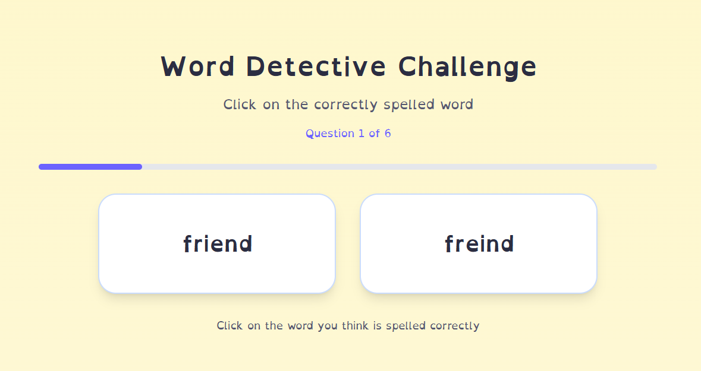
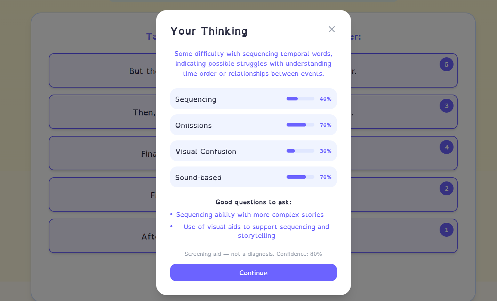

# LexiAssist : AI-Powered Dyslexia Screening Tool

> A full-stack web application that uses gamified activities and Groq AI to screen children (ages 8–12) for early signs of dyslexia, generating personalized learning insights from gameplay data.

[](https://lexiassistdyslexia.vercel.app/)
[](https://storybook-backend-qqtb.onrender.com/health)
[](https://react.dev)
[](https://typescriptlang.org)
[](https://python.org)
[](https://fastapi.tiangolo.com)
[](https://console.groq.com)
[](LICENSE)

---

## Overview

LexiAssist makes early dyslexia screening accessible and non-intimidating. Instead of clinical forms, children go through three interactive games : letter matching, story comprehension, and word recognition; while the app quietly analyses patterns like visual letter confusion (b/d, p/q), phonological reasoning, and sequencing ability.

After the games, Groq's Llama 3.1 generates two additional AI-personalised story rounds tailored to the child's language preference, then analyses their responses to produce a structured learning profile with actionable recommendations for parents and educators.

---

<div align="center">
  
</div>

## Features

- **3 gamified screening activities** : Letter Match, Storybook Challenge, and Word Detective, each designed to surface specific dyslexia markers
- **AI-generated story rounds** : Llama 3.1 dynamically generates story sequences with strategically placed visual and phonological confusion triggers
- **AI response analysis** : per-round analysis scoring visual confusion, phonological cues, sequencing ability, and omissions on a 0–1 scale
- **Personalised results dashboard** : learning profile with risk assessment, strengths, learning style classification, and tailored recommendations
- **Multilingual support** : English, Hindi, and Tamil throughout the UI and AI prompts
- **5-step parent onboarding** : collects child profile, learning background, and consent before the screening begins
- **Fallback resilience** : hardcoded fallback rounds ensure the app never breaks even if the AI backend is unavailable

---

<div align="center">
  
</div>

## Tech Stack

**Frontend**
- React 18 + TypeScript
- Vite
- Tailwind CSS + shadcn/ui
- React Router v6
- TanStack Query
- Deployed on Vercel

**Backend**
- Python + FastAPI
- Groq API (`llama-3.1-8b-instant`) via `groq`
- In-memory session caching for generated rounds
- Deployed on Render

---

## Architecture
```
┌─────────────────────────────────┐        ┌──────────────────────────────┐
│        Vercel (Frontend)        │        │       Render (Backend)       │
│                                 │        │                              │
│  React + Vite SPA               │─────── │  FastAPI                     │
│  ├── Onboarding (5-step form)   │  REST  │  ├── POST /generate-rounds   │
│  ├── Letter Match game          │        │  ├── POST /analyze-response  │
│  ├── Storybook Challenge        │        │  └── GET  /health            │
│  ├── Word Detective game        │        │             │                │
│  └── Results dashboard          │        │             ▼                │
│                                 │        │         Groq API             │
└─────────────────────────────────┘        └──────────────────────────────┘
```

The frontend calls the backend after round 3 to fetch two AI-generated story rounds. Each round is cached per session to avoid redundant API calls. If the AI backend is unavailable, pre-written fallback rounds are served automatically.

---

## AI Design

The prompts are engineered specifically for dyslexia screening, not general story generation:

- **Visual confusion triggers** : sentences include words with b/d, p/q, and n/u letter pairs
- **Phonological cues** : words with similar sounds but different meanings test sound-based reasoning
- **Temporal sequencing** : sentences use words like *first*, *then*, *before*, *finally* to test ordering ability
- **Response analysis** : after each AI round, the child's ordering is sent back to Llama 3.1, which scores four markers and suggests follow-up questions for educators

---

## Getting Started

### Prerequisites

- Node.js 18+
- Python 3.11+
- A [Groq API key](https://console.groq.com) (free tier)

### Frontend
```bash
git clone https://github.com/neerajgandhii/lexiassist.dyslexia
cd lexiassist.dyslexia
npm install
npm run dev
```

Create a `.env` file in the root:
```
VITE_API_URL=http://localhost:8000
```

### Backend
```bash
git clone https://github.com/neerajgandhii/Storybook-Backend
cd Storybook-Backend
pip install -r requirements.txt
```

Create a `.env` file:
```
GROQ_API_KEY=your_api_key_here
```
```bash
uvicorn main:app --reload --port 8000
```

API docs available at `http://localhost:8000/docs`

---

## API Reference

| Method | Endpoint | Description |
|--------|----------|-------------|
| `POST` | `/api/storybook/generate-rounds` | Generate 2 AI story rounds for the session |
| `POST` | `/api/storybook/analyze-response` | Analyse child's ordering for dyslexia markers |
| `GET` | `/health` | Health check + API key status |

**Sample `/analyze-response` output:**
```json
{
  "analysis": {
    "sequencing":       { "score": 0.8, "note": "Strong grasp of temporal order" },
    "visualConfusion":  { "score": 0.6, "note": "Possible b/d confusion with 'bed' and 'doll'" },
    "phonologicalCue":  { "score": 0.4, "note": "Some sound-based reasoning detected" },
    "omissions":        { "score": 0.1, "note": "No key elements omitted" },
    "recommendedFollowUps": ["Ask the child to read the sentences aloud..."],
    "confidence": 0.82
  },
  "source": "ai"
}
```

---

## Project Structure
```
lexiassist.dyslexia/
├── src/
│   ├── auth/
│   │   ├── pages/          # 5-step onboarding flow
│   │   └── AuthContext.tsx
│   ├── components/
│   │   ├── Storybook.tsx   # Main game + AI integration
│   │   ├── LetterMatch.tsx
│   │   └── WordDetective.tsx
│   ├── pages/
│   │   ├── Results.tsx     # Learning profile dashboard
│   │   └── Screening.tsx
│   └── context/
│       └── TestContext.tsx  # Global test state
├── public/
│   └── storybook-assets/   # Game images
└── ...

Storybook-Backend/
├── main.py                 # FastAPI app + CORS
└── routes/
    └── storybook.py        # Groq integration + endpoints
```

---

## Disclaimer

LexiAssist is a screening tool, not a diagnostic instrument. Results should be used as a starting point for conversation with qualified healthcare professionals or educational psychologists - not as a clinical diagnosis.

---

## Contact Me

**Neeraj Gandhi**

[](https://www.linkedin.com/in/neerajgandhii/)
[](mailto:neerajgandhii2003@gmail.com)

---

## License

MIT License — Copyright (c) 2025

Permission is hereby granted, free of charge, to any person obtaining a copy of this software and associated documentation files (the "Software"), to deal in the Software without restriction, including without limitation the rights to use, copy, modify, merge, publish, distribute, sublicense, and/or sell copies of the Software, and to permit persons to whom the Software is furnished to do so, subject to the following conditions:

The above copyright notice and this permission notice shall be included in all copies or substantial portions of the Software.

THE SOFTWARE IS PROVIDED "AS IS", WITHOUT WARRANTY OF ANY KIND, EXPRESS OR IMPLIED, INCLUDING BUT NOT LIMITED TO THE WARRANTIES OF MERCHANTABILITY, FITNESS FOR A PARTICULAR PURPOSE AND NONINFRINGEMENT. IN NO EVENT SHALL THE AUTHORS OR COPYRIGHT HOLDERS BE LIABLE FOR ANY CLAIM, DAMAGES OR OTHER LIABILITY, WHETHER IN AN ACTION OF CONTRACT, TORT OR OTHERWISE, ARISING FROM, OUT OF OR IN CONNECTION WITH THE SOFTWARE OR THE USE OR OTHER DEALINGS IN THE SOFTWARE.